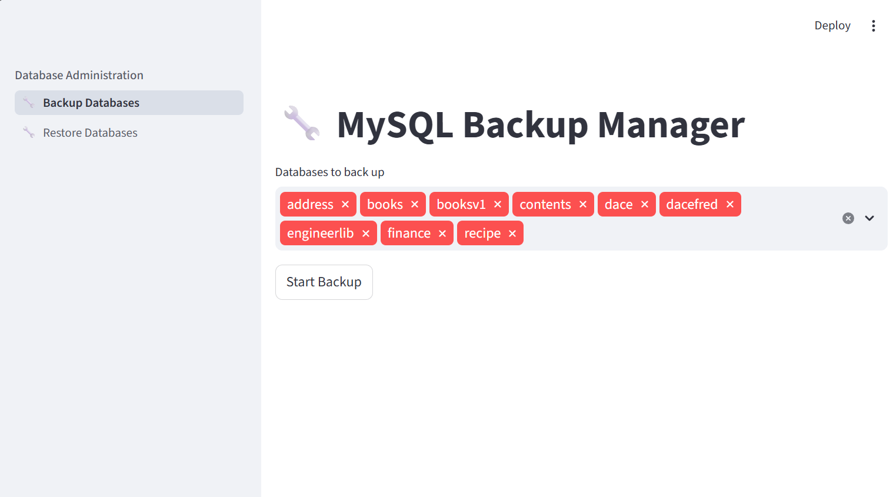
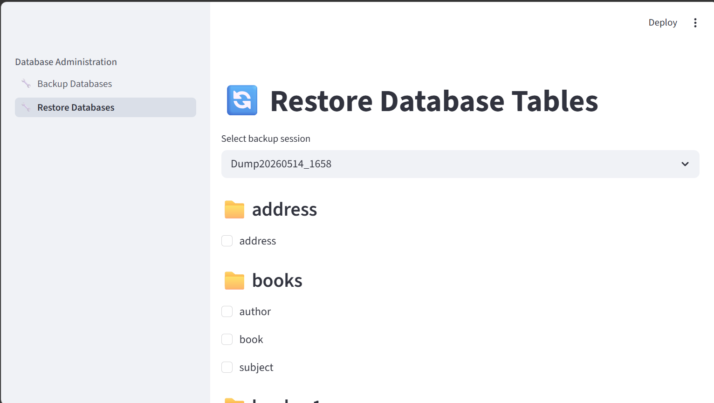

# MySQL Backup Manager

A lightweight, Streamlit-powered backup and restore utility designed specifically for small MySQL databases. Built to replace the deprecated backup/restore functionality in MySQL Workbench with a simple, modern, and easy-to-maintain alternative.

## 📖 Why This Tool?

With the official phasing out of MySQL Workbench’s built-in backup and restore features, developers and small teams have been left searching for a straightforward replacement. This project fills that gap by providing a focused, no-frills interface dedicated exclusively to:
- **Backing up** databases safely and quickly
- **Restoring** from `.sql` dumps with confidence
- **Keeping maintenance simple** for small-scale MySQL deployments

No bloated IDE features, no steep learning curve—just reliable, local backup management.

## 📸 Visual Preview

> *Note: The images below are for illustrative purposes only and may differ slightly from your local environment or theme.*

### Backup Interface

### Restore Interface

## 🚀 Quick Start

### 1. Prerequisites
- Python 3.8+
- `streamlit` (`pip install streamlit`)
- Local access to a MySQL server
- MySQL CLI executables: `mysql` and `mysqldump` (typically bundled with MySQL Server or Community tools)

### 2. Configuration
This application uses Streamlit’s secure secrets management. Before running the app, you must configure your database credentials and executable paths.

1. Open the included `secretstest.toml` file. It contains clear instructions and a template for all required settings.
2. Create a new file named `secrets.toml` inside the `.streamlit` directory in your project root:
